###

 

###

<h4 align="left">A versatile Cyber Security Engineer and penetration tester with hands-on experience in vulnerability assessments, threat detection, and incident response. Skilled in leveraging tools like Burp Suite, Metasploit, and SIEM/XDR platforms to identify and mitigate risks across applications, networks, and infrastructure. Passionate about red teaming, continuous learning, and delivering clear, actionable security solutions to strengthen organizational defenses.</h4>

###

 

<picture>
  <source media="(prefers-color-scheme: dark)" srcset="https://raw.githubusercontent.com/RavinduRathnayaka/RavinduRathnayaka/output/pacman-contribution-graph-dark.svg">
  <source media="(prefers-color-scheme: light)" srcset="https://raw.githubusercontent.com/RavinduRathnayaka/RavinduRathnayaka/output/pacman-contribution-graph.svg">
  
</picture>

###

###

###

###

###

###

###

###

 

 

 

 
###

  
  
  
  
  
  
  
  
  
  
  
  
  
  
  
  
  
  
  
  
  
  
  
  
  
  
  
  
  
  
  

###

  
  

###

 

###

  
  
  

###
